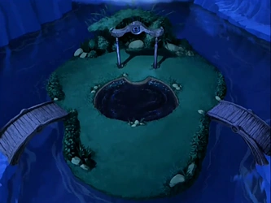

# The Spirit Oasis
by Avatar: the First Pixelbenders (Beatrice Hoang, Claire Yang, Joe Maffa, and Vivian Li).

This project is a reimagination of a scene in the episode "The Siege of the North" from _Avatar: the Last Airbender_. In the Spirit Oasis, two koi fish Tui and La maintain the balance between the Earth and the Moon. When the fish are disturbed, chaos ensues.

Using ThreeJS and Blender, we modeled this scene using realistic water effects, lighting changes, and koi fish interaction.

## Installation
To start our web app locally, follow the [ThreeJS installation instructions](https://threejs.org/docs/#manual/en/introduction/Installation). Once configured, run our web app with `npx vite`.

## How to interact
- Drag around the screen to view the scene from different angles
- Hover and move mouse over the pond to move ripples
- Drag Tui and La out of the pond to change lighting
- Press `b` to turn on/off bloom effect in the water.

## Technical Features
### God (Crepuscular) Rays (Beatrice)
Crepuscular rays are simulated over the pond using randomly generated cylindrical light models.

### Fish Movement + Interaction (Beatrice)
Tui and La follow generative Bezier curves and react to user interaction. Once they are picked up, the lighting in the scene changes to reflect the loss of the waterbending power. They can be dropped back into the pond at any moment and will return to their paths.

### Worley Noise Water (Joe)
Worley Noise chooses random points along a grid and calculates noise based on distance from the grid points. The effect of this is a cell-like pattern reminiscent of the water bloom that occurs in the scene when the Koizilla is summoned. This noise is used to simulate the ocean water wave movement and the visual shading of the waves which both intensify with the bloom user interaction.

### Pond Simulation + Interactivity (Claire)
The pond is implemented as an animated mesh with ripples following sine and cosine waves to modify height over time.  Users can interact with the pond to push ripples based on mouse position. Bloom effect intensifies the waves and brightens the water as well.

### Models (Vivian, Claire)
Aspects of the scene were modeled in Blender. In particular, Vivian modeled the island, bridges, and fish. Claire modeled the bamboo. These models were loaded in using GLTF.

### Waterfall Particle System (Joe)
The waterfall and its splash are simulated as two animated particle systems. The waterfall randomly generates falling water particles that are continuously respawned at its origin. The mist effect is created by a smoke texture that is randomly spawned and moves outward with time.

### Grass Simulation (Vivian)
Grass is procedurally generated using an InstancedMesh and animated to create a smooth swaying effect to model wind.

### Custom Toon Shader (Vivian)
Postprocessing is done with a custom toon shader and watercolor renderpass that discretizes the scene color and fuzzes edges to create a paper-like texture.

## Demo

https://github.com/user-attachments/assets/996ea3a7-bc1c-4e93-a957-a18d54498147

